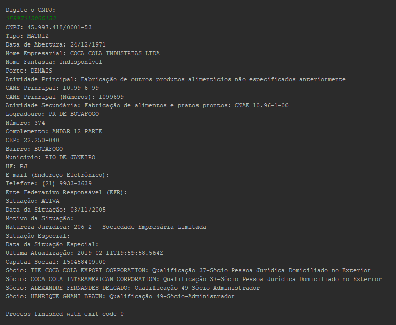

Package integrante da suite DACBr, para consulta online de CNPJ.

Integração com API Receita WS (https://www.receitaws.com.br). Se você estava procurando um webservice gratuito e de alto desempenho para consultar CNPJ? Utilize o serviço, melhore a qualidade de suas aplicações e colabore para manter esta base de dados atualizada.



## Uso

Um simples exemplo de uso:

```dart
import 'package:dacbr_cnpj/dacbr_cnpj.dart';
import 'dart:io';

main() async {
  print('Digite o CNPJ: ');
  String cnpjDigitado = stdin.readLineSync();

  try {
    final empresa = await DacbrCnpj.searchCNPJ(cnpjDigitado);

    print('CNPJ: ${empresa.cnpj}');
    print('Tipo: ${empresa.tipo}');
    print('Data de Abertura: ${empresa.abertura}');
    print('Nome Empresarial: ${empresa.nome}');
    print('Nome Fantasia: ${empresa.fantasia}');
    print('Porte: ${empresa.porte}');
    print('Atividade Principal: ${empresa.atividadePrincipal}');
    print('CANE Prinripal: ${empresa.CNAEPrincipal}');
    print('CANE Prinripal (Números): ${empresa.atividadePrincipalNumber}');

    empresa.atividadesSecundarias.forEach((atividade) =>
      print('Atividade Secundária: ${atividade.text}: CNAE ${atividade.code}')
    );

    print('Logradouro: ${empresa.logradouro}');
    print('Número: ${empresa.numero}');
    print('Complemento: ${empresa.complemento}');
    print('CEP: ${empresa.cep}');
    print('Bairro: ${empresa.bairro}');
    print('Municipio: ${empresa.municipio}');
    print('UF: ${empresa.uf}');
    print('E-mail (Endereço Eletrônico): ${empresa.email}');
    print('Telefone: ${empresa.telefone}');
    print('Ente Federativo Responsável (EFR): ${empresa.efr}');
    print('Situação: ${empresa.situacao}');
    print('Data da Situação: ${empresa.data_situacao}');
    print('Motivo da Situação: ${empresa.motivo_situacao}');
    print('Natureza Juridica: ${empresa.natureza_juridica}');
    print('Situação Especial: ${empresa.situacao_especial}');
    print('Data da Situação Especial: ${empresa.data_situacao_especial}');
    print('Ultima Atualização: ${empresa.ultima_atualizacao}');
    print('Capital Social: ${empresa.capital_social}');

    empresa.qsa.forEach((qsa) =>
      print('Sócio: ${qsa.nome}: Qualificação ${qsa.qual}')
    );

  } catch (error) {
    print("Acontenceu um erro ao comunicar com a api");
    print(error);
  }
}

```

## Recursos

- Recupera o CNPJ da Empresa.
- Recupera o Tipo da Empresa (Matriz/Filial).
- Recupera a Data da Abertura da Empresa.
- Recupera o Nome Empresarial da Empresa.
- Recupera o Nome Fantasia da Empresa.
- Recupera o Porte da Empresa.
- Recupera o Ramo de Atividade Principal da Empresa.
- Recupera o CNAE Principal da Empresa.
- Recupera o CNAE Principal (em números) da Empresa.
- Recupera o Logradouro do endereço da Empresa.
- Recupera o Número do endereço da Empresa.
- Recupera o Complemento do endereço da Empresa.    
- Recupera o CEP do endereço da Empresa.
- Recupera o Bairro do endereço da Empresa.
- Recupera o Estado do endereço da Empresa.
- Recupera o e-mail da Empresa.
- Recupera o telefone da Empresa.
- Recupera o EFR (Ente Federativo Responsável) da Empresa.
- Recupera a Situação do cadastro CNPJ da Empresa.
- Recupera a data da Situação do cadastro do CNPJ da Empresa.
- Recupera o motivo situação da Empresa.
- Recupera a Natureza Juridica da Empresa.
- Recupera a data da situação especial da Empresa.
- Recupera a data da última atualização do registro junto a SEFAZ.         

Caso queira conhecer melhor o funcionamento da API acesse o site de origem da API (https://www.receitaws.com.br)
    
## Funcionalidades e Bugs

Por favor para requisições de funcionalidades e bugs [issue tracker][tracker].

[tracker]: https://github.com/projetodacbr/dacbr_cnpj/issues